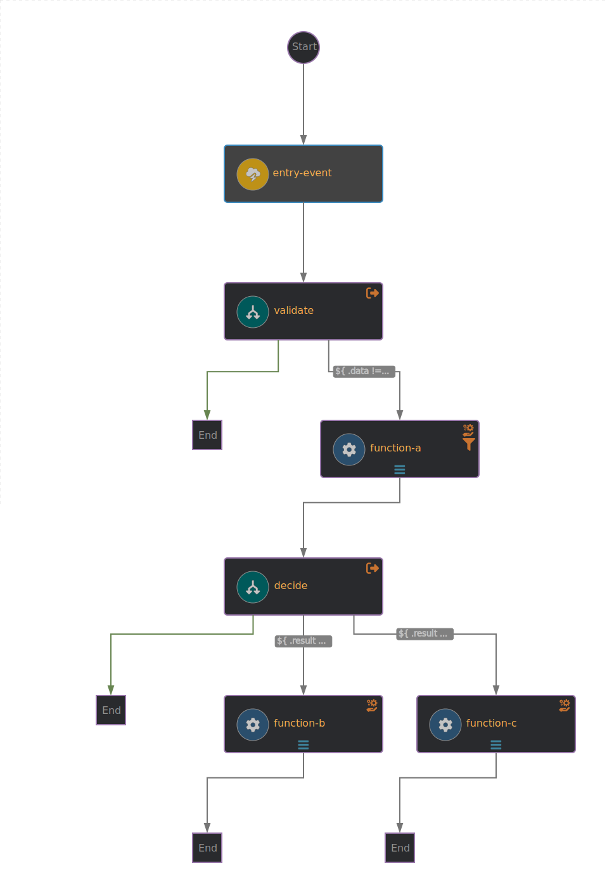

# Simple Conditional Workflow

This was a workflow to get things up and running using SonataFlow. The workflow can be analyzed in the figure below.


From a CloudEvent with the field `data` as `true` or `false`, the workflow will launch `function-b` or `function-c`. Function `function-a` is only used for a little bit more testing, but it also returns `true` or `false` depending on the data from the original event.
This application is also composed of an `entry-point`, that receives a typical HTTP request and translates it to the corresponding CloudEvent that then can be processed by the workflow.

All these functions are deployed as Knative Services.

## Install
```
kubectl apply -f kubernetes.yaml
cd workflow/src/main/kubernetes && kubectl apply -f kogito.yml && kubectl apply -f knative.yml
```
